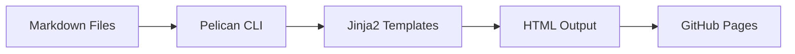
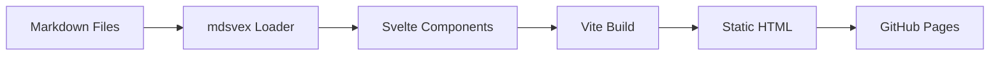

# Pelican to SvelteKit Migration Guide

A comprehensive step-by-step guide for converting your Pelican blog to a SvelteKit static site.

## Table of Contents

1. [Overview](#overview)
2. [Architecture Comparison](#architecture-comparison)
3. [Prerequisites](#prerequisites)
4. [Step-by-Step Migration](#step-by-step-migration)
5. [File Structure Mapping](#file-structure-mapping)
6. [Template Conversion Guide](#template-conversion-guide)
7. [Configuration Migration](#configuration-migration)
8. [Deployment Setup](#deployment-setup)
9. [Testing Checklist](#testing-checklist)

---

## Overview

### Current State (Pelican)

```
Pelican Blog Structure
├── blog/
│   ├── content/          # Markdown source files
│   ├── theme/            # Jinja2 templates + static assets
│   ├── output/           # Generated HTML (deployed to GitHub Pages)
│   └── pelicanconf.py    # Configuration
└── pyproject.toml        # Python dependencies
```

### Target State (SvelteKit)

```
SvelteKit Blog Structure
├── src/
│   ├── routes/           # File-based routing
│   │   ├── +page.svelte  # Homepage
│   │   ├── [slug]/       # Dynamic article routes
│   │   └── about/        # Static pages
│   ├── lib/              # Utilities and components
│   └── app.html          # Root HTML template
├── static/               # Static assets (CSS, JS, images)
├── content/              # Markdown blog posts (moved from blog/content)
└── svelte.config.js      # SvelteKit configuration
```

---

## Architecture Comparison

### Technology Stack

| Component | Pelican | SvelteKit |
|-----------|---------|-----------|
| **Language** | Python | JavaScript/TypeScript |
| **Templates** | Jinja2 | Svelte Components |
| **Markdown** | Python-Markdown | mdsvex |
| **Build Tool** | Pelican CLI | Vite (via SvelteKit) |
| **Static Assets** | Copied to output | Processed by Vite |
| **Routing** | URL generation | File-based routing |
| **Deployment** | Static HTML | Static HTML (adapter-static) |

### Data Flow Comparison

#### Pelican Flow



#### SvelteKit Flow



### Feature Mapping

| Feature | Pelican Implementation | SvelteKit Implementation |
|---------|----------------------|-------------------------|
| **Markdown Processing** | Python-Markdown with extensions | mdsvex with frontmatter |
| **Template Inheritance** | Jinja2 `extends` | Svelte `<slot>` and layouts |
| **Article Metadata** | Frontmatter in markdown | Frontmatter via mdsvex |
| **Categories/Tags** | Pelican metadata | Custom load functions |
| **Pagination** | Pelican pagination | Custom pagination logic |
| **Theme Toggle** | Vanilla JS | Svelte component + stores |
| **Code Highlighting** | Prism.js (client-side) | Prism.js (SSR compatible) |
| **Math Rendering** | MathJax (client-side) | MathJax (SSR compatible) |
| **Mermaid Diagrams** | Client-side rendering | Client-side rendering |

---

## Prerequisites

### Required Tools

- **Node.js** 18+ and npm/pnpm/yarn
- **Git** (for version control)
- **GitHub account** (for deployment)

### Required Knowledge

- Basic understanding of:
  - JavaScript/TypeScript
  - Svelte component syntax
  - Markdown
  - File-based routing concepts

---

## Step-by-Step Migration

### Phase 1: Project Setup

#### Step 1.1: Initialize SvelteKit Project

```bash
# Create new SvelteKit project
npm create svelte@latest blog-sveltekit
cd blog-sveltekit

# Choose options:
# - Skeleton project
# - TypeScript: Yes
# - Add type checking: Yes
# - ESLint: Yes
# - Prettier: Yes
# - Playwright: Optional
```

#### Step 1.2: Install Required Dependencies

```bash
npm install

# Install markdown processing
npm install -D mdsvex

# Install frontmatter parsing
npm install gray-matter

# Install date formatting (if needed)
npm install date-fns

# Install static adapter for GitHub Pages
npm install -D @sveltejs/adapter-static
```

#### Step 1.3: Configure SvelteKit for Static Site

**Update `svelte.config.js`:**

```javascript
import adapter from '@sveltejs/adapter-static';
import { vitePreprocess } from '@sveltejs/vite-plugin-svelte';

/** @type {import('@sveltejs/kit').Config} */
const config = {
  preprocess: vitePreprocess(),
  kit: {
    adapter: adapter({
      pages: 'build',
      assets: 'build',
      fallback: undefined,
      precompress: false,
      strict: true
    }),
    prerender: {
      entries: ['*']
    }
  }
};

export default config;
```

**Update `vite.config.js` to add mdsvex:**

```javascript
import { sveltekit } from '@sveltejs/kit/vite';
import { defineConfig } from 'vite';

export default defineConfig({
  plugins: [sveltekit()],
  assetsInclude: ['**/*.md']
});
```

**Create `mdsvex.config.js`:**

```javascript
import { defineMDSveXConfig } from 'mdsvex';

const config = defineMDSveXConfig({
  extensions: ['.md', '.svx'],
  layout: {
    _: './src/lib/components/MarkdownLayout.svelte'
  },
  remarkPlugins: [],
  rehypePlugins: []
});

export default config;
```

**Update `svelte.config.js` to include mdsvex:**

```javascript
import adapter from '@sveltejs/adapter-static';
import { vitePreprocess } from '@sveltejs/vite-plugin-svelte';
import { mdsvex } from 'mdsvex';

/** @type {import('@sveltejs/kit').Config} */
const config = {
  extensions: ['.svelte', '.md', '.svx'],
  preprocess: [
    vitePreprocess(),
    mdsvex({
      extensions: ['.md', '.svx']
    })
  ],
  kit: {
    adapter: adapter({
      pages: 'build',
      assets: 'build',
      fallback: undefined,
      precompress: false,
      strict: true
    }),
    prerender: {
      entries: ['*']
    }
  }
};

export default config;
```

---

### Phase 2: Content Migration

#### Step 2.1: Move Content Files

```bash
# Create content directory
mkdir -p content/posts content/pages

# Copy markdown files from Pelican
cp -r ../blog/content/*.md content/posts/
cp -r ../blog/content/pages/*.md content/pages/
```

#### Step 2.2: Normalize Frontmatter

Pelican frontmatter format:

```yaml
---
title: Article Title
date: 2025-11-17
category: misc
tags: python, geospatial
excerpt: "Article summary"
---
```

SvelteKit/mdsvex uses the same format, so **no changes needed** for basic frontmatter.

#### Step 2.3: Create Content Loader Utility

**Create `src/lib/utils/content.ts`:**

```typescript
import { error } from '@sveltejs/kit';
import type { PageLoad } from './$types';
import fs from 'fs';
import path from 'path';
import matter from 'gray-matter';

export interface Post {
  slug: string;
  title: string;
  date: string;
  category?: string;
  tags?: string[];
  excerpt?: string;
  content: string;
  math?: boolean;
}

export function getPosts(): Post[] {
  const postsDirectory = path.join(process.cwd(), 'content/posts');
  const filenames = fs.readdirSync(postsDirectory);
  
  const posts = filenames
    .filter(name => name.endsWith('.md'))
    .map(filename => {
      const filePath = path.join(postsDirectory, filename);
      const fileContents = fs.readFileSync(filePath, 'utf8');
      const { data, content } = matter(fileContents);
      
      // Extract slug from filename (remove date prefix and .md)
      const slug = filename
        .replace(/^\d{4}-\d{2}-\d{2}-/, '')
        .replace(/\.md$/, '');
      
      return {
        slug,
        title: data.title || 'Untitled',
        date: data.date || '',
        category: data.category,
        tags: Array.isArray(data.tags) ? data.tags : 
              typeof data.tags === 'string' ? data.tags.split(',').map(t => t.trim()) : [],
        excerpt: data.excerpt,
        content,
        math: data.math || false
      };
    })
    .sort((a, b) => new Date(b.date).getTime() - new Date(a.date).getTime());
  
  return posts;
}

export function getPostBySlug(slug: string): Post | null {
  const posts = getPosts();
  return posts.find(post => post.slug === slug) || null;
}

export function getPages() {
  const pagesDirectory = path.join(process.cwd(), 'content/pages');
  if (!fs.existsSync(pagesDirectory)) return [];
  
  const filenames = fs.readdirSync(pagesDirectory);
  return filenames
    .filter(name => name.endsWith('.md'))
    .map(filename => {
      const filePath = path.join(pagesDirectory, filename);
      const fileContents = fs.readFileSync(filePath, 'utf8');
      const { data, content } = matter(fileContents);
      
      const slug = filename.replace(/\.md$/, '');
      
      return {
        slug,
        title: data.title || slug,
        content,
        date: data.date
      };
    });
}
```

**Note:** For SvelteKit, you'll need to use `+page.ts` load functions instead. Update approach:

**Create `src/lib/utils/content.server.ts`:**

```typescript
import fs from 'fs';
import path from 'path';
import matter from 'gray-matter';

export interface Post {
  slug: string;
  title: string;
  date: string;
  category?: string;
  tags?: string[];
  excerpt?: string;
  content: string;
  math?: boolean;
}

export function getPosts(): Post[] {
  const postsDirectory = path.join(process.cwd(), 'content/posts');
  if (!fs.existsSync(postsDirectory)) return [];
  
  const filenames = fs.readdirSync(postsDirectory);
  
  const posts = filenames
    .filter(name => name.endsWith('.md'))
    .map(filename => {
      const filePath = path.join(postsDirectory, filename);
      const fileContents = fs.readFileSync(filePath, 'utf8');
      const { data, content } = matter(fileContents);
      
      const slug = filename
        .replace(/^\d{4}-\d{2}-\d{2}-/, '')
        .replace(/\.md$/, '');
      
      return {
        slug,
        title: data.title || 'Untitled',
        date: data.date || '',
        category: data.category,
        tags: Array.isArray(data.tags) ? data.tags : 
              typeof data.tags === 'string' ? data.tags.split(',').map(t => t.trim()) : [],
        excerpt: data.excerpt,
        content,
        math: data.math || false
      };
    })
    .sort((a, b) => new Date(b.date).getTime() - new Date(a.date).getTime());
  
  return posts;
}

export function getPostBySlug(slug: string): Post | null {
  const posts = getPosts();
  return posts.find(post => post.slug === slug) || null;
}

export function getPages() {
  const pagesDirectory = path.join(process.cwd(), 'content/pages');
  if (!fs.existsSync(pagesDirectory)) return [];
  
  const filenames = fs.readdirSync(pagesDirectory);
  return filenames
    .filter(name => name.endsWith('.md'))
    .map(filename => {
      const filePath = path.join(pagesDirectory, filename);
      const fileContents = fs.readFileSync(filePath, 'utf8');
      const { data, content } = matter(fileContents);
      
      const slug = filename.replace(/\.md$/, '');
      
      return {
        slug,
        title: data.title || slug,
        content,
        date: data.date
      };
    });
}
```

---

### Phase 3: Template Conversion

#### Step 3.1: Convert Base Template

**Pelican `base.html` → SvelteKit `src/app.html` and `src/routes/+layout.svelte`**

**Create `src/app.html`:**

```html
<!DOCTYPE html>
<html lang="%sveltekit.lang%">
  <head>
    <meta charset="utf-8" />
    <link rel="icon" href="%sveltekit.assets%/favicon.png" />
    <meta name="viewport" content="width=device-width, initial-scale=1" />
    %sveltekit.head%
  </head>
  <body data-sveltekit-preload-data="hover">
    <div style="display: contents">%sveltekit.body%</div>
  </body>
</html>
```

**Create `src/routes/+layout.svelte`:**

```svelte
<script lang="ts">
  import '../app.css';
  import Header from '$lib/components/Header.svelte';
  import Footer from '$lib/components/Footer.svelte';
  import { onMount } from 'svelte';
  
  // Initialize theme and scripts on mount
  onMount(() => {
    // Theme toggle initialization
    import('$lib/js/theme-toggle.js');
    // Other scripts
    import('$lib/js/mermaid-renderer.js');
    import('$lib/js/safe-highlighting.js');
  });
</script>

<svelte:head>
  <title>blog</title>
  <meta name="description" content="fmaz's blog" />
  
  <!-- External CSS -->
  <link rel="stylesheet" href="https://cdn.jsdelivr.net/npm/holiday.css@0.11.2" />
  <link rel="stylesheet" href="https://cdnjs.cloudflare.com/ajax/libs/font-awesome/5.15.3/css/all.min.css" />
  <link rel="preconnect" href="https://fonts.googleapis.com" />
  <link rel="preconnect" href="https://fonts.gstatic.com" crossorigin />
  <link href="https://fonts.googleapis.com/css2?family=Inter:wght@400;500;600;700&family=JetBrains+Mono:wght@400;500;600&display=swap" rel="stylesheet" />
  
  <!-- Prism.js -->
  <link href="https://cdnjs.cloudflare.com/ajax/libs/prism/1.29.0/themes/prism-vsc-dark-plus.min.css" rel="stylesheet" media="(prefers-color-scheme: dark)" />
  <link href="https://cdnjs.cloudflare.com/ajax/libs/prism/1.29.0/themes/prism.min.css" rel="stylesheet" media="(prefers-color-scheme: light)" />
  <script src="https://cdnjs.cloudflare.com/ajax/libs/prism/1.29.0/components/prism-core.min.js"></script>
  <script src="https://cdnjs.cloudflare.com/ajax/libs/prism/1.29.0/plugins/autoloader/prism-autoloader.min.js"></script>
  
  <!-- MathJax -->
  <script type="text/javascript" async
    src="https://cdnjs.cloudflare.com/ajax/libs/mathjax/2.7.1/MathJax.js?config=TeX-AMS-MML_HTMLorMML">
  </script>
  
  <!-- Mermaid -->
  <script src="https://cdn.jsdelivr.net/npm/mermaid@10.9.1/dist/mermaid.min.js"></script>
</svelte:head>

<Header />
<main>
  <slot />
</main>
<Footer />
```

#### Step 3.2: Convert Header Component

**Create `src/lib/components/Header.svelte`:**

```svelte
<script lang="ts">
  import { page } from '$app/stores';
  import { onMount } from 'svelte';
  
  // Get navigation items (could be from a config file)
  const navItems = [
    { title: 'Home', href: '/' },
    { title: 'About', href: '/about' }
  ];
  
  let mobileMenuOpen = false;
  
  function toggleMobileMenu() {
    mobileMenuOpen = !mobileMenuOpen;
  }
</script>

<header>
  <nav>
    <ul>
      <li><a href="/">blog</a></li>
      {#each navItems as item}
        <li>
          <a 
            href={item.href}
            aria-current={$page.url.pathname === item.href ? 'page' : undefined}
          >
            {item.title}
          </a>
        </li>
      {/each}
    </ul>
  </nav>
  
  <button 
    class="mobile-menu-toggle" 
    title="Toggle navigation menu"
    aria-label="Toggle navigation menu"
    on:click={toggleMobileMenu}
  >
    <div class="hamburger-icon">
      <span></span>
      <span></span>
      <span></span>
    </div>
  </button>
  
  {#if mobileMenuOpen}
    <nav class="mobile-nav">
      <ul>
        <li><a href="/">blog</a></li>
        {#each navItems as item}
          <li>
            <a 
              href={item.href}
              aria-current={$page.url.pathname === item.href ? 'page' : undefined}
            >
              {item.title}
            </a>
          </li>
        {/each}
      </ul>
    </nav>
  {/if}
  
  <button class="theme-toggle" title="Toggle theme" aria-label="Toggle dark/light mode"></button>
</header>
```

#### Step 3.3: Convert Footer Component

**Create `src/lib/components/Footer.svelte`:**

```svelte
<script lang="ts">
  const currentYear = new Date().getFullYear();
  
  const socialLinks = [
    { name: 'GitHub', url: 'https://github.com/FMazzoni', icon: 'fab fa-github' },
    { name: 'LinkedIn', url: 'https://www.linkedin.com/in/fernando-mazzoni', icon: 'fab fa-linkedin' }
  ];
</script>

<footer>
  {#each socialLinks as social}
    <a href={social.url}>
      <i class={social.icon}></i> {social.name}
    </a>
  {/each}
  <p>© {currentYear} fmaz. All rights reserved.</p>
</footer>
```

#### Step 3.4: Create Homepage

**Create `src/routes/+page.svelte`:**

```svelte
<script lang="ts">
  import type { PageData } from './$types';
  
  export let data: PageData;
</script>

<svelte:head>
  <title>blog - All Posts</title>
</svelte:head>

<article>
  
  {#each data.posts as post}
    <article class="summary-content">
      <header>
        <h1>
          <a href="/{post.slug}" rel="bookmark" title="Permalink to {post.title}">
            {post.title}
          </a>
        </h1>
      </header>
      <section>
        {#if post.excerpt}
          {@html post.excerpt}
        {:else}
          {@html post.content.split('\n').slice(0, 3).join('\n')}
        {/if}
      </section>
      <footer>
        <em>
          <time datetime={post.date}>
            {new Date(post.date).toLocaleDateString('en-US', { 
              month: 'short', 
              day: 'numeric', 
              year: '2-digit' 
            })}
          </time>
        </em>
      </footer>
    </article>
  {/each}
</article>
```

**Create `src/routes/+page.ts`:**

```typescript
import type { PageLoad } from './$types';
import { getPosts } from '$lib/utils/content.server';

export const load: PageLoad = async () => {
  const posts = getPosts();
  
  return {
    posts
  };
};
```

#### Step 3.5: Create Article Page

**Create `src/routes/[slug]/+page.svelte`:**

```svelte
<script lang="ts">
  import type { PageData } from './$types';
  import { onMount } from 'svelte';
  
  export let data: PageData;
  
  // Initialize MathJax and Prism after content loads
  onMount(() => {
    // MathJax will auto-render if configured
    if (typeof window !== 'undefined' && (window as any).MathJax) {
      (window as any).MathJax.Hub.Queue(['Typeset', (window as any).MathJax.Hub]);
    }
    
    // Prism highlighting
    if (typeof window !== 'undefined' && (window as any).Prism) {
      (window as any).Prism.highlightAll();
    }
  });
</script>

<svelte:head>
  <title>blog - {data.post.title}</title>
  {#if data.post.excerpt}
    <meta name="description" content={data.post.excerpt} />
  {/if}
  {#if data.post.tags}
    <meta name="tags" content={data.post.tags.join(', ')} />
  {/if}
</svelte:head>

<article class="post-content">
  <header>
    <h1>{data.post.title}</h1>
  </header>
  {@html data.post.content}
</article>
```

**Create `src/routes/[slug]/+page.ts`:**

```typescript
import { error } from '@sveltejs/kit';
import type { PageLoad } from './$types';
import { getPostBySlug, getPosts } from '$lib/utils/content.server';

export const load: PageLoad = async ({ params }) => {
  const post = getPostBySlug(params.slug);
  
  if (!post) {
    throw error(404, 'Post not found');
  }
  
  // Get all posts for navigation
  const allPosts = getPosts();
  const currentIndex = allPosts.findIndex(p => p.slug === params.slug);
  const nextPost = currentIndex > 0 ? allPosts[currentIndex - 1] : null;
  const prevPost = currentIndex < allPosts.length - 1 ? allPosts[currentIndex + 1] : null;
  
  return {
    post,
    nextPost,
    prevPost
  };
};

// Generate static paths for all posts
export const entries = async () => {
  const posts = getPosts();
  return posts.map(post => ({ slug: post.slug }));
};
```

---

### Phase 4: Static Assets Migration

#### Step 4.1: Move CSS Files

```bash
# Copy CSS to static directory
mkdir -p static/css
cp blog/theme/static/css/style.css static/css/
```

**Create `src/app.css` to import the main stylesheet:**

```css
@import '../static/css/style.css';
```

#### Step 4.2: Move JavaScript Files

```bash
# Copy JS files
mkdir -p src/lib/js
cp blog/theme/static/js/*.js src/lib/js/
```

**Update JavaScript files to be ES modules if needed:**

- `theme-toggle.js` - Should work as-is or convert to ES module
- `mermaid-renderer.js` - May need updates for SvelteKit
- `safe-highlighting.js` - May need updates
- `mobile-navigation.js` - May need updates
- `language-badges.js` - May need updates

#### Step 4.3: Update JavaScript for SvelteKit

Most vanilla JS should work, but you may need to:

1. **Convert to ES modules** if using `import/export`
2. **Use Svelte's `onMount`** for initialization instead of `DOMContentLoaded`
3. **Use Svelte stores** for state management instead of global variables

**Example: Theme Toggle as Svelte Component**

**Create `src/lib/components/ThemeToggle.svelte`:**

```svelte
<script lang="ts">
  import { onMount } from 'svelte';
  import { writable } from 'svelte/store';
  
  const THEME_KEY = 'blog-theme';
  const THEMES = {
    DARK: 'dark',
    LIGHT: 'light'
  };
  
  const theme = writable<THEMES.DARK | THEMES.LIGHT>(THEMES.DARK);
  
  onMount(() => {
    // Get stored theme or default
    const stored = localStorage.getItem(THEME_KEY) || THEMES.DARK;
    theme.set(stored as any);
    applyTheme(stored);
    
    // Listen for system theme changes
    if (window.matchMedia) {
      const mediaQuery = window.matchMedia('(prefers-color-scheme: dark)');
      mediaQuery.addEventListener('change', (e) => {
        if (!localStorage.getItem(THEME_KEY)) {
          const newTheme = e.matches ? THEMES.DARK : THEMES.LIGHT;
          theme.set(newTheme);
          applyTheme(newTheme);
        }
      });
    }
  });
  
  function applyTheme(newTheme: string) {
    document.documentElement.setAttribute('data-theme', newTheme);
  }
  
  function toggleTheme() {
    theme.update(current => {
      const newTheme = current === THEMES.DARK ? THEMES.LIGHT : THEMES.DARK;
      localStorage.setItem(THEME_KEY, newTheme);
      applyTheme(newTheme);
      return newTheme;
    });
  }
  
  $: isDark = $theme === THEMES.DARK;
</script>

<button 
  class="theme-toggle" 
  title={isDark ? 'Switch to light mode' : 'Switch to dark mode'}
  aria-label="Toggle dark/light mode"
  on:click={toggleTheme}
>
  {#if isDark}
    <!-- Sun icon SVG -->
    <svg viewBox="0 0 24 24" xmlns="http://www.w3.org/2000/svg" fill="none">
      <circle cx="12" cy="12" r="4" fill="currentColor"/>
      <path d="m12 1v3" stroke="currentColor" stroke-width="2" stroke-linecap="round"/>
      <path d="m12 20v3" stroke="currentColor" stroke-width="2" stroke-linecap="round"/>
      <path d="m1 12h3" stroke="currentColor" stroke-width="2" stroke-linecap="round"/>
      <path d="m20 12h3" stroke="currentColor" stroke-width="2" stroke-linecap="round"/>
      <path d="m4.22 4.22 2.12 2.12" stroke="currentColor" stroke-width="2" stroke-linecap="round"/>
      <path d="m17.66 17.66 2.12 2.12" stroke="currentColor" stroke-width="2" stroke-linecap="round"/>
      <path d="m4.22 19.78 2.12-2.12" stroke="currentColor" stroke-width="2" stroke-linecap="round"/>
      <path d="m17.66 6.34 2.12-2.12" stroke="currentColor" stroke-width="2" stroke-linecap="round"/>
    </svg>
  {:else}
    <!-- Moon icon SVG -->
    <svg viewBox="0 0 24 24" xmlns="http://www.w3.org/2000/svg" fill="none">
      <path d="M21 12.79A9 9 0 1 1 11.21 3 7 7 0 0 0 21 12.79z" fill="currentColor"/>
    </svg>
  {/if}
</button>
```

---

### Phase 5: Configuration Migration

#### Step 5.1: Site Configuration

**Create `src/lib/config/site.ts`:**

```typescript
export const siteConfig = {
  name: 'blog',
  author: 'fmaz',
  email: '',
  url: 'https://fmazzoni.github.io',
  timezone: 'America/New_York',
  defaultLang: 'en',
  
  social: [
    { name: 'GitHub', url: 'https://github.com/FMazzoni', icon: 'fab fa-github' },
    { name: 'LinkedIn', url: 'https://www.linkedin.com/in/fernando-mazzoni', icon: 'fab fa-linkedin' }
  ],
  
  links: [
    { title: 'Python', url: 'https://www.python.org/' },
    { title: 'Pelican', url: 'https://getpelican.com/' },
    { title: 'Jinja2', url: 'https://palletsprojects.com/p/jinja/' }
  ],
  
  pagination: {
    postsPerPage: 10
  }
};
```

#### Step 5.2: Update Package.json Scripts

**Update `package.json`:**

```json
{
  "scripts": {
    "dev": "vite dev",
    "build": "vite build",
    "preview": "vite preview",
    "check": "svelte-kit sync && svelte-check --ts --jsx && tsc --noEmit",
    "check:watch": "svelte-kit sync && svelte-check --ts --jsx --watch",
    "lint": "prettier --check . && eslint .",
    "format": "prettier --write ."
  }
}
```

---

### Phase 6: GitHub Pages Deployment

#### Step 6.1: Update SvelteKit Config for GitHub Pages

**Update `svelte.config.js`:**

```javascript
import adapter from '@sveltejs/adapter-static';
import { vitePreprocess } from '@sveltejs/vite-plugin-svelte';
import { mdsvex } from 'mdsvex';

const dev = process.env.NODE_ENV === 'development';

/** @type {import('@sveltejs/kit').Config} */
const config = {
  extensions: ['.svelte', '.md', '.svx'],
  preprocess: [
    vitePreprocess(),
    mdsvex({
      extensions: ['.md', '.svx']
    })
  ],
  kit: {
    adapter: adapter({
      pages: 'build',
      assets: 'build',
      fallback: undefined,
      precompress: false,
      strict: true
    }),
    paths: {
      base: dev ? '' : '/fmazzoni.github.io', // Your repo name
      relative: false
    },
    prerender: {
      entries: ['*']
    }
  }
};

export default config;
```

#### Step 6.2: Create GitHub Actions Workflow

**Create `.github/workflows/deploy.yml`:**

```yaml
name: Deploy to GitHub Pages

on:
  push:
    branches: ['main']
  workflow_dispatch:

permissions:
  contents: read
  pages: write
  id-token: write

concurrency:
  group: 'pages'
  cancel-in-progress: false

jobs:
  build:
    runs-on: ubuntu-latest
    steps:
      - name: Checkout
        uses: actions/checkout@v4
      
      - name: Setup Node.js
        uses: actions/setup-node@v4
        with:
          node-version: '20'
          cache: 'npm'
      
      - name: Install dependencies
        run: npm ci
      
      - name: Build
        run: npm run build
        env:
          NODE_ENV: production
      
      - name: Setup Pages
        uses: actions/configure-pages@v4
      
      - name: Upload artifact
        uses: actions/upload-pages-artifact@v3
        with:
          path: './build'

  deploy:
    environment:
      name: github-pages
      url: ${{ steps.deployment.outputs.page_url }}
    runs-on: ubuntu-latest
    needs: build
    steps:
      - name: Deploy to GitHub Pages
        id: deployment
        uses: actions/deploy-pages@v4
```

#### Step 6.3: Update Base Path in Production

**Create `src/hooks.ts` (optional, for dynamic base path):**

```typescript
import { dev } from '$app/environment';

export const base = dev ? '' : '/fmazzoni.github.io';
```

---

## File Structure Mapping

### Complete File Mapping Table

| Pelican Location | SvelteKit Location | Notes |
|-----------------|-------------------|-------|
| `blog/content/*.md` | `content/posts/*.md` | Blog posts |
| `blog/content/pages/*.md` | `content/pages/*.md` | Static pages |
| `blog/theme/templates/base.html` | `src/routes/+layout.svelte` | Root layout |
| `blog/theme/templates/index.html` | `src/routes/+page.svelte` | Homepage |
| `blog/theme/templates/article.html` | `src/routes/[slug]/+page.svelte` | Article page |
| `blog/theme/templates/page.html` | `src/routes/[slug]/+page.svelte` | Static page (same as article) |
| `blog/theme/templates/categories.html` | `src/routes/categories/+page.svelte` | Categories listing |
| `blog/theme/templates/category.html` | `src/routes/category/[slug]/+page.svelte` | Category page |
| `blog/theme/templates/tags.html` | `src/routes/tags/+page.svelte` | Tags listing |
| `blog/theme/templates/tag.html` | `src/routes/tag/[slug]/+page.svelte` | Tag page |
| `blog/theme/static/css/style.css` | `static/css/style.css` | Stylesheet |
| `blog/theme/static/js/*.js` | `src/lib/js/*.js` | JavaScript utilities |
| `blog/pelicanconf.py` | `src/lib/config/site.ts` | Site configuration |
| `blog/output/` | `build/` | Build output (gitignored) |

---

## Template Conversion Guide

### Jinja2 to Svelte Syntax Mapping

| Jinja2 | Svelte | Example |
|--------|--------|---------|
| `` | `<script>` + layout | Use `+layout.svelte` |
| `` | `<slot />` | Content slot |
| `{{ variable }}` | `{variable}` | `{post.title}` |
| `` | `{#each items as item}` | `{#each posts as post}` |
| `` | `{#if condition}` | `{#if post.excerpt}` |
| `` | `<Component />` | `<Header />` |
| `{{ SITEURL }}/{{ article.url }}` | `/{post.slug}` | Dynamic routing |
| `` | `let var = value` | In `<script>` |

### Common Patterns

#### Template Inheritance

**Pelican:**

```jinja2


  <h1>{{ article.title }}</h1>

```

**SvelteKit:**

```svelte
<script lang="ts">
  export let data;
</script>

<h1>{data.post.title}</h1>
```

#### Loops

**Pelican:**

```jinja2

  <article>{{ article.title }}</article>

```

**SvelteKit:**

```svelte
{#each data.posts as post}
  <article>{post.title}</article>
{/each}
```

#### Conditionals

**Pelican:**

```jinja2

  <p>{{ article.excerpt }}</p>

```

**SvelteKit:**

```svelte
{#if post.excerpt}
  <p>{post.excerpt}</p>
{/if}
```

---

## Configuration Migration

### Pelican Config → SvelteKit Config

| Pelican Setting | SvelteKit Equivalent | Location |
|----------------|---------------------|----------|
| `AUTHOR` | `siteConfig.author` | `src/lib/config/site.ts` |
| `SITENAME` | `siteConfig.name` | `src/lib/config/site.ts` |
| `SITEURL` | `siteConfig.url` | `src/lib/config/site.ts` |
| `TIMEZONE` | `siteConfig.timezone` | `src/lib/config/site.ts` |
| `DEFAULT_PAGINATION` | `siteConfig.pagination.postsPerPage` | `src/lib/config/site.ts` |
| `SOCIAL` | `siteConfig.social` | `src/lib/config/site.ts` |
| `LINKS` | `siteConfig.links` | `src/lib/config/site.ts` |
| `THEME` | N/A (components in `src/lib/components/`) | - |
| `STATIC_PATHS` | Files in `static/` directory | - |
| `MARKDOWN` extensions | `mdsvex.config.js` | `mdsvex.config.js` |

---

## Deployment Setup

### GitHub Pages Configuration

1. **Repository Settings:**
   - Go to Settings → Pages
   - Source: GitHub Actions
   - Branch: `main` (or your default branch)

2. **Build Process:**

   ```bash
   npm run build
   # Outputs to ./build directory
   ```

3. **Verify Build:**

   ```bash
   npm run preview
   # Test locally before deploying
   ```

### Deployment Checklist

- [ ] Update `svelte.config.js` with correct `base` path
- [ ] Create GitHub Actions workflow
- [ ] Enable GitHub Pages in repository settings
- [ ] Test build locally (`npm run build`)
- [ ] Test preview locally (`npm run preview`)
- [ ] Push to main branch
- [ ] Verify deployment in Actions tab
- [ ] Check site at `https://[username].github.io/[repo-name]`

---

## Testing Checklist

### Pre-Deployment Testing

- [ ] All blog posts render correctly
- [ ] Static pages (About) render correctly
- [ ] Navigation works (header, mobile menu)
- [ ] Theme toggle works (dark/light mode)
- [ ] Code highlighting works (Prism.js)
- [ ] Math rendering works (MathJax)
- [ ] Mermaid diagrams render
- [ ] Links work (internal and external)
- [ ] Images load correctly
- [ ] CSS styling is correct
- [ ] Mobile responsive design works
- [ ] All JavaScript features work

### Post-Deployment Testing

- [ ] Site loads at GitHub Pages URL
- [ ] All routes are accessible
- [ ] No 404 errors
- [ ] Assets load correctly (CSS, JS, images)
- [ ] External CDN resources load
- [ ] SEO meta tags are present
- [ ] Social sharing works (if implemented)

---

## Common Issues and Solutions

### Issue 1: Markdown Not Rendering

**Problem:** Markdown content shows as raw text.

**Solution:**

- Ensure `mdsvex` is properly configured in `svelte.config.js`
- Check that markdown files are imported correctly
- Verify frontmatter parsing with `gray-matter`

### Issue 2: Images Not Loading

**Problem:** Images from markdown don't display.

**Solution:**

- Place images in `static/` directory
- Reference as `/image.png` (absolute from root)
- Or use SvelteKit's asset handling: `import image from '$lib/assets/image.png'`

### Issue 3: MathJax Not Rendering

**Problem:** Math equations don't render.

**Solution:**

- Ensure MathJax script is in `+layout.svelte` `<svelte:head>`
- Call `MathJax.Hub.Queue(['Typeset', MathJax.Hub])` after content loads
- Use `onMount` in article component

### Issue 4: Routes Not Found (404)

**Problem:** Article pages return 404.

**Solution:**

- Ensure `entries()` function in `+page.ts` generates all slugs
- Check that `getPosts()` function works correctly
- Verify file-based routing structure matches URLs

### Issue 5: Base Path Issues

**Problem:** Assets don't load on GitHub Pages.

**Solution:**

- Set `paths.base` in `svelte.config.js` to repository name
- Use `$app/paths` for dynamic base path in components
- Ensure all asset paths are absolute or use SvelteKit's asset handling

---

## Migration Timeline Estimate

| Phase | Tasks | Estimated Time |
|-------|-------|----------------|
| **Phase 1: Setup** | Initialize project, install dependencies | 30-60 min |
| **Phase 2: Content** | Move files, create loaders | 1-2 hours |
| **Phase 3: Templates** | Convert all templates to Svelte | 2-4 hours |
| **Phase 4: Assets** | Move and update CSS/JS | 1-2 hours |
| **Phase 5: Config** | Migrate configuration | 30-60 min |
| **Phase 6: Deployment** | Setup GitHub Actions | 30-60 min |
| **Testing** | Test all features | 1-2 hours |
| **Total** | | **7-12 hours** |

---

## Next Steps After Migration

1. **Add Features:**
   - RSS feed generation
   - Search functionality
   - Tag/category filtering
   - Related posts
   - Comments system (optional)

2. **Optimize:**
   - Image optimization
   - Code splitting
   - Lazy loading
   - Performance monitoring

3. **Enhance:**
   - Add TypeScript types for content
   - Create reusable components
   - Add animations/transitions
   - Improve SEO

---

## Resources

- [SvelteKit Documentation](https://kit.svelte.dev/)
- [mdsvex Documentation](https://mdsvex.pngwn.io/)
- [SvelteKit Static Adapter](https://kit.svelte.dev/docs/adapter-static)
- [GitHub Pages Deployment](https://kit.svelte.dev/docs/adapter-static#github-pages)

---

## Conclusion

This migration is **moderately complex** but very achievable. The main work involves:

1. Converting Jinja2 templates to Svelte components
2. Setting up markdown processing with mdsvex
3. Creating data load functions
4. Migrating static assets
5. Configuring deployment

The benefits include:

- Modern development experience
- Better performance
- Easier to extend and maintain
- TypeScript support
- Component reusability

Good luck with your migration! 🚀
