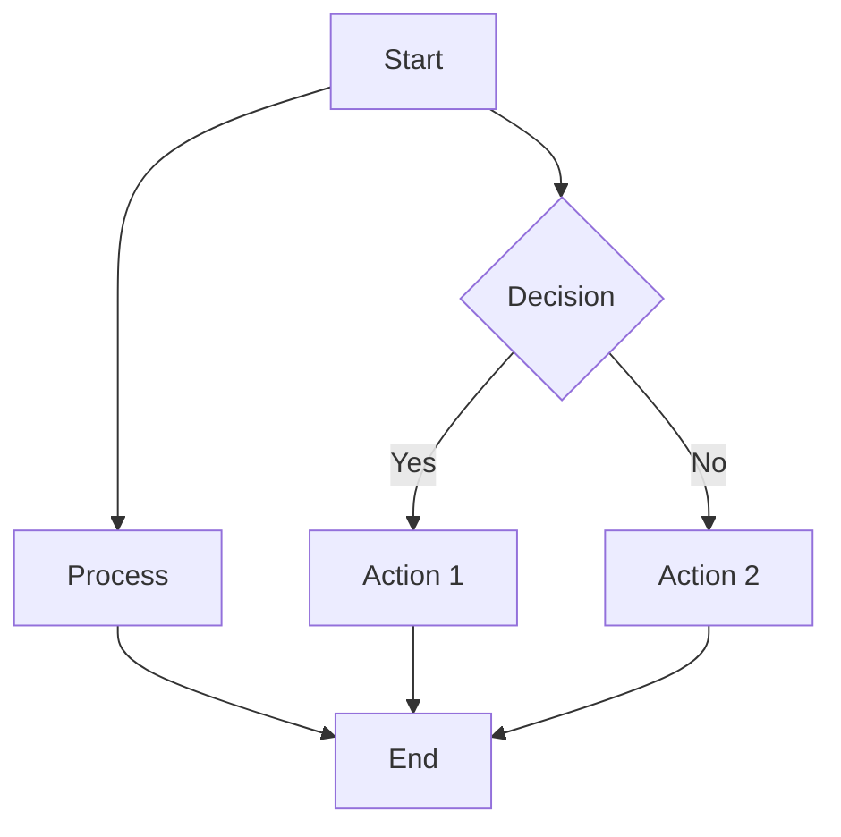

## Writing math in markdown

Inline math written with just `$a^2+b^2=c^2$` is awesome. $a^2+b^2=c^2$.

As well as block math:

$$
f(x) = \int_{-\infty}^\infty
\hat f(\xi) e^{2 \pi i \xi x}
 d\xi
$$

written with the below snippet surrounded by `$$`:

```latex
f(x) = \int_{-\infty}^\infty
\hat f(\xi) e^{2 \pi i \xi x}
d\xi
```

Alternatively, you can use the `align` environment with labels for equation references. For example:

```latex
\begin{align} \label{gauss}
\int_0^\infty e^{-x^2} dx=\frac{\sqrt{\pi}}{2}
\end{align}
```

which will render as:

\begin{align} \label{gauss}
\int_0^\infty e^{-x^2} dx=\frac{\sqrt{\pi}}{2}
\end{align}

You can reference the equation with `\ref{gauss}`. For example, equation \ref{gauss} is the Gaussian integral.

## Creating diagrams with Mermaid

Mermaid diagrams are supported using code blocks with the `mermaid` language:



This site uses [Mermaid.js](https://mermaid.js.org/) for diagram rendering, which supports flowcharts, sequence diagrams, Gantt charts, and more.
